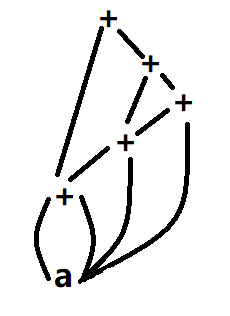

# 编译原理 作业7

**151220129 计科 吴政亿 nju_wzy@163.com**

## 6.1.2

## 6.2.2

1. a = b[i] + c[j]

   1. 四元式序列

      |      | $op$ | $arg_1$ | $arg_2$ | $result$ |
      | ---- | ---- | ------- | ------- | -------- |
      | 0    | *    | $i$     | 8       | $t_1$    |
      | 1    | =[]  | $b$     | $t_1$   | $t_2$    |
      | 2    | *    | $j$     | 8       | $t_3$    |
      | 3    | =[]  | $c$     | $t_3$   | $t_4$    |
      | 4    | +    | $t_3$   | $t_4$   | $t_5$    |
      | 5    | =    | $t_5$   |         | $a$      |

      ​

      ​

   2. 三元式序列

      |      | $op$ | $arg_1$ | $arg_2$ |
      | ---- | ---- | ------- | ------- |
      | 0    | *    | $i$     | 8       |
      | 1    | =[]  | $b$     | (0)     |
      | 2    | *    | $j$     | 8       |
      | 3    | =[]  | $c$     | (2)     |
      | 4    | +    | (1)     | (3)     |
      | 5    | =    | $a$     | (4)     |

2. a[i] = b\*c - b\*d

   1. 四元式序列

      |      | $op$ | $arg_1$ | $arg_2$ | $result$ |
      | ---- | ---- | ------- | ------- | -------- |
      | 0    | *    | $b$     | $c$     | $t_!$    |
      | 1    | *    | $b$     | $d$     | $t_2$    |
      | 2    | -    | $t_1$   | $t_2$   | $t_3$    |
      | 3    | *    | $i$     | 8       | $t_4$    |
      | 4    | []=  | $t_4$   | $t_3$   | $a$      |

   2. 三元式序列

      |      | $op$ | $arg_1$ | $arg_2$ |
      | ---- | ---- | ------- | ------- |
      | 0    | *    | $b$     | $c$     |
      | 1    | *    | $b$     | $d$     |
      | 2    | -    | (0)     | (1)     |
      | 3    | *    | $i$     | 8       |
      | 4    | +    | $a$     | (3)     |
      | 5    | *=   | (4)     | (2)     |

      ​

